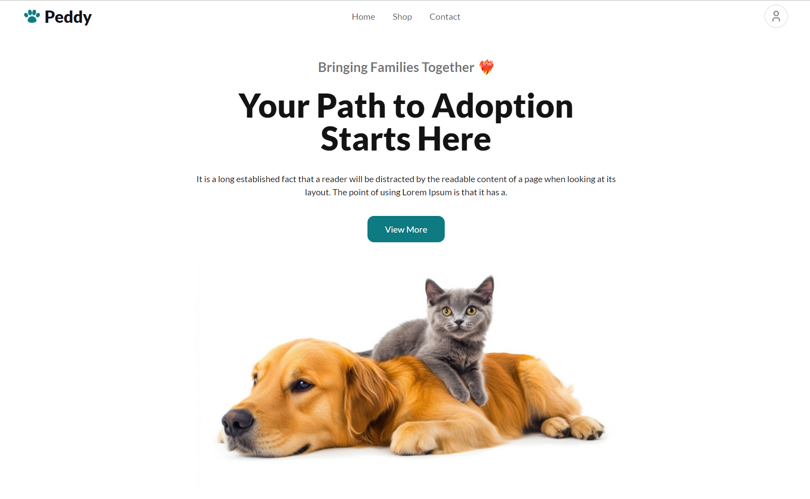

# Project Name: Peddy Pets Adopt

### Project Description
This Project is about a website which helps users to adopt their favourite pets, like a pet, and get information like breed, birth date, price, details etc.

### Key Features of this project
- Fetch pets category and show in UI
- Fetch pets data and display in card layout design
- Fetch pets data when clickin on a pet category
- Sort pets data by price in descending order
- Show liked pets thumbnail when clicked like button
- Show pet details when clicked on details button
- All section are responsive for all devices

### Some ES6 Features used
- `Fetch API` to get data from an endpoint
- `Template string` to dynamicaly show data
- `Arrow functions` to write concise code
- Uses of `let, const` instead of var
- `Async await` to handle api responses
- Methods like `foreach, sort` are used

### Live site link: [peddypets-adopt.netlify.app](https://peddypets-adopt.netlify.app/)

